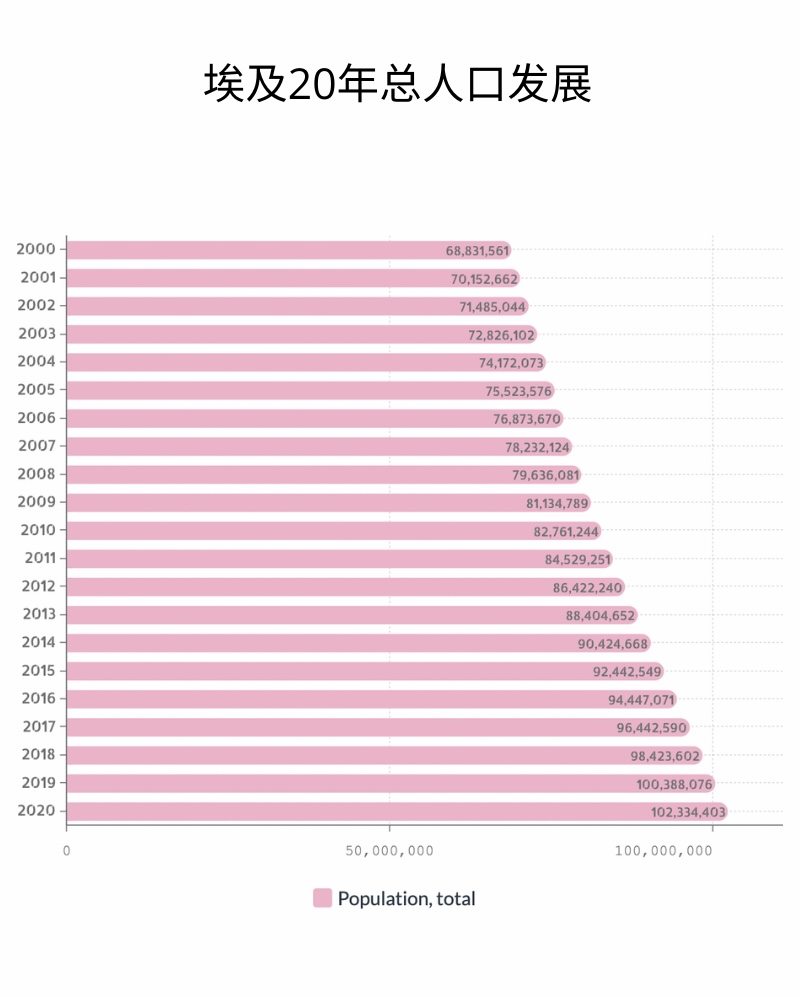
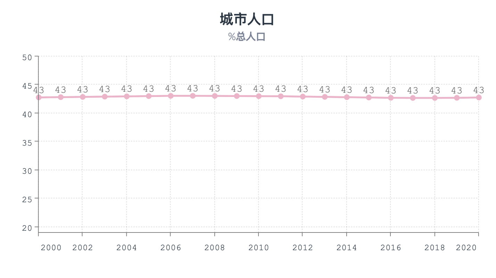
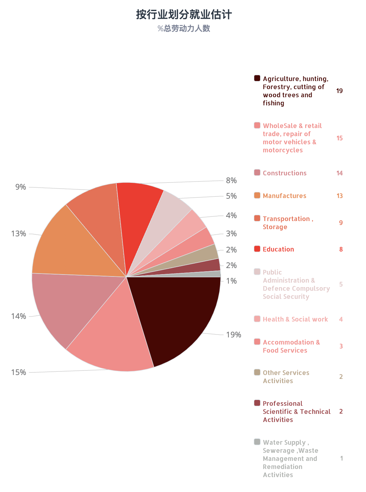
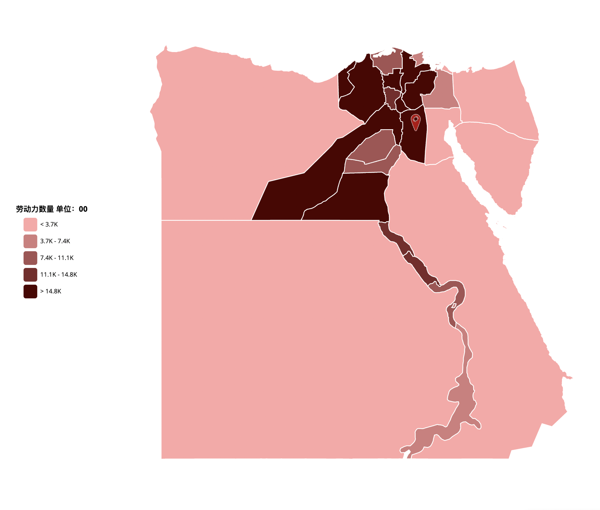
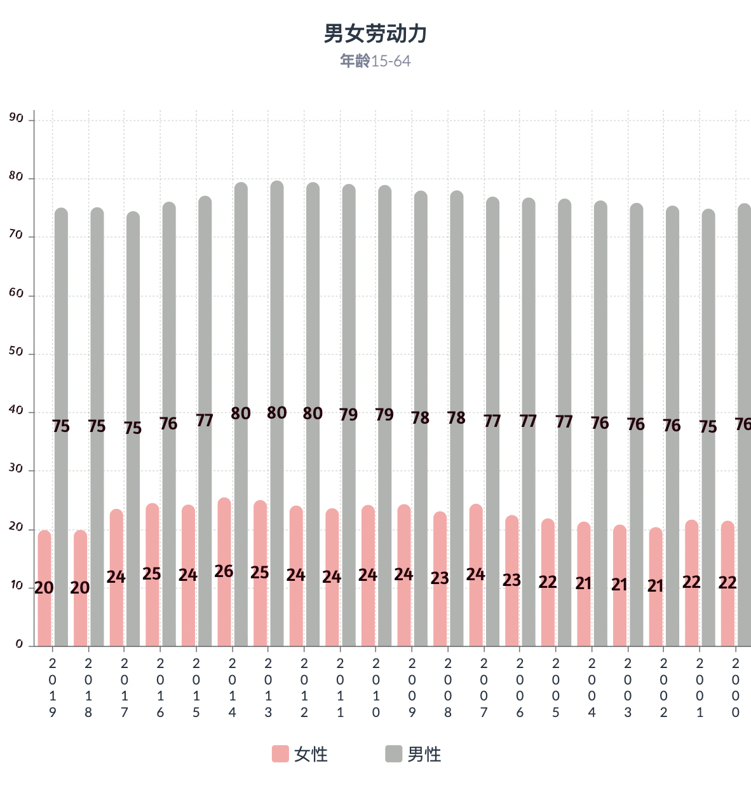
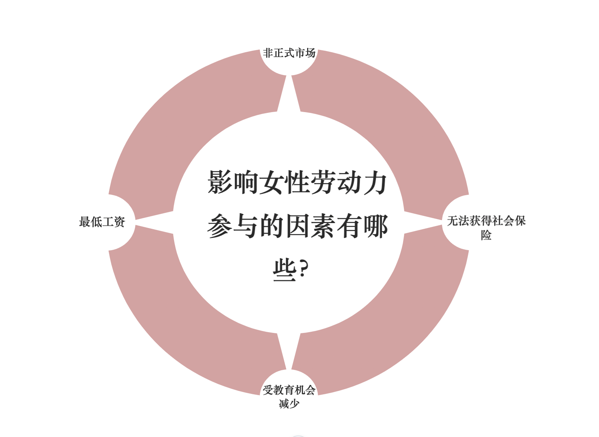
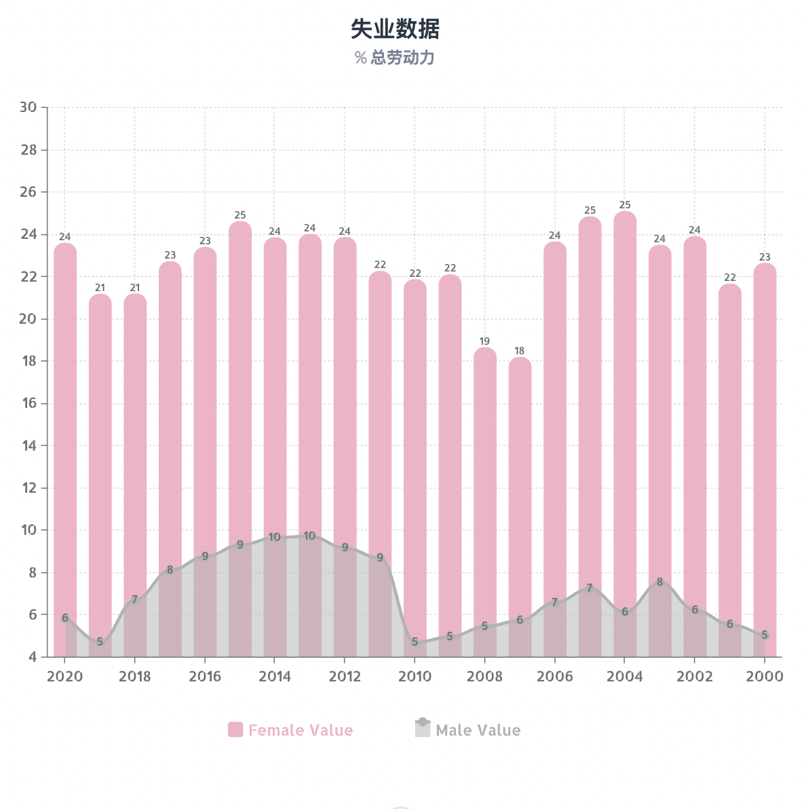
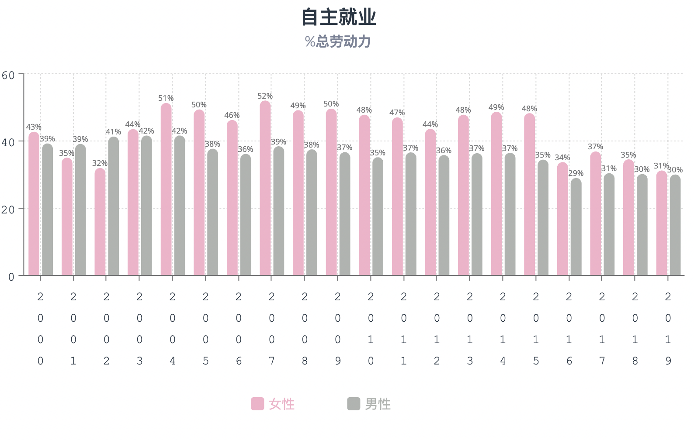

<!DOCTYPE html>
<html>

<head>
    

    
</head>

<body>
    

    <h1 style="font-style: italic;font-size: xx-large;font-weight: bold;font-family:'Lucida Sans', 'Lucida Sans Regular', 'Lucida Grande', 'Lucida Sans Unicode', Geneva, Verdana, sans-serif;">埃及近20年的社会发展 （2000-2020）</h1>

 

    
埃及在最近20年经历了很多社会的发展与变化，以下拿了一些数据分析分析

    
首先是埃及2000-2020年的总人口图

    
    
数据来源：世界银行
    

        
    
数据来源：世界银行

    

        
在埃及人口的20年的发展中，平均寿命分为女性：74岁，男性：70岁。

        

            那么说到埃及城区总人口呢。我们能看到在20年的时间，城区人口几乎没有改变。这也说明埃及还是便于农村地区，而且根据下面的行业分析能发现埃及的最受欢迎的行业还是在农村地区。

        
只有大概45%的人愿意在城区生活的，其他事选择在农村里生活。

    

    
    
数据来源：埃及中央公共动员和统计局
    

    

    

        那么根据上面的图，我们来分析一下埃及最受欢迎的行业。根据2021年的年度统计，我们能看道最受欢迎的是农业，总劳动力人数达到了52322人，一共总劳动力的19.2%。第二最大的行业是贸易以及零售，总劳动力人数到了40768人，占有总劳动力的15%。
        第三是建筑业，总劳动力人数达到了37384人，总劳动力的13.8%。第四个是制造商，总劳动力人数达到了34140人，总劳动力的12.6%。 在第五位是运输行业，总劳动力人数达到了24206人，总劳动力的8.9%.

    
那么这样我们能理解埃及人的农村地区的偏爱，不但是农业的，而且很多的新建筑、制造业项目都是在农村傍边发展的。

    
接下来介绍埃及劳动力分布地图，我们能看到，接近首都的城市劳动力数量要高一点。

 
    
    
数据来源：埃及中央公共动员和统计局
    

        

    
如果拿埃及地图做简单的分析，我们能学到，在尼罗河的两岸这地方，农业最发达的。所以人口比较多的北方靠近尼罗河的一些城市劳动力人数最多。

        
 
        
    
数据来源：埃及中央公共动员和统计局
    

        

    

        那么在上面的图能看到埃及男女劳动力的差别非常的大。原因有很多，比如：女性在埃及面临的低工资，很多公司还是会把女性的工资低于男性的。女性在非正式市场工作也是一个很大的问题，特别是在没受足够教育的农村地区，导致该地区的女性识字率较低，所以无法参与正式工作市场。另外是埃及女性无法获得很好的社会保险。
    

    

    
    
数据来源：埃及中央公共动员和统计局
    

        

    
 这也导致了女性失业人数比男性要高很多。

    

    
    
数据来源：埃及中央公共动员和统计局
    

        

    
那么由于上面的原因，数据说明在埃及选择做自由工作的人，还是女性比男性要多一点。

    
20年的平均值是：女性为43.6%，男性为36.3%

    

    
    
数据来源：世界银行

        作者：安琳
        指导老师：白净教授
