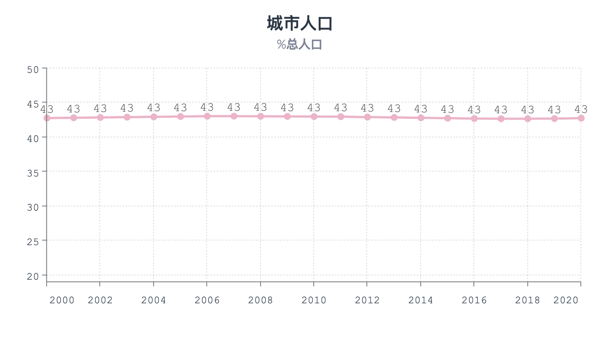
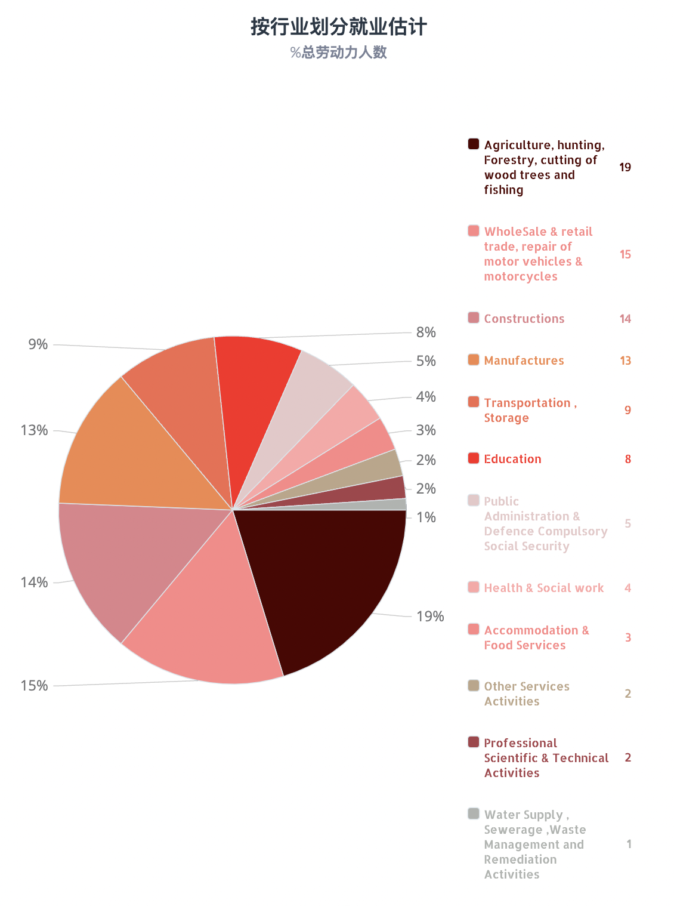
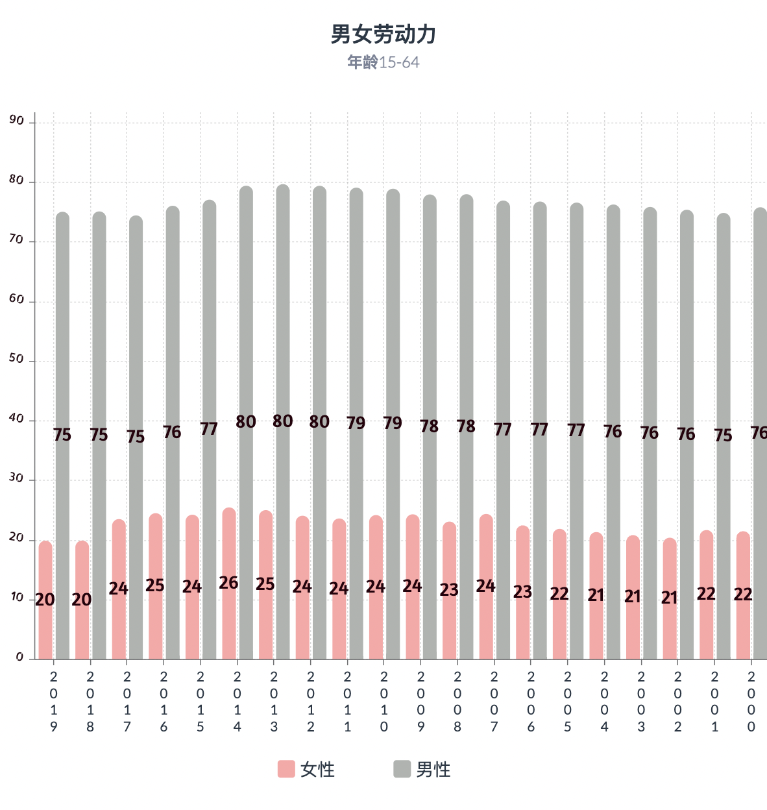
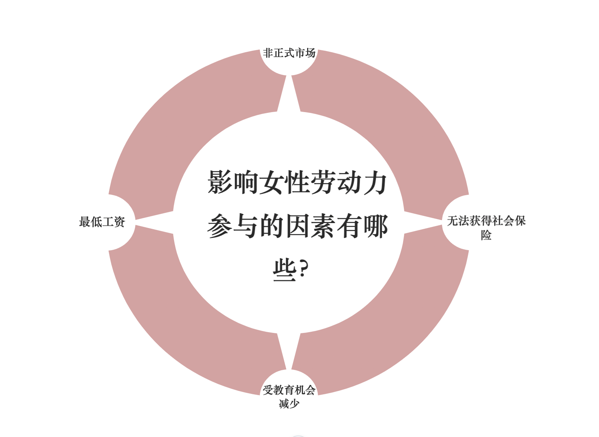
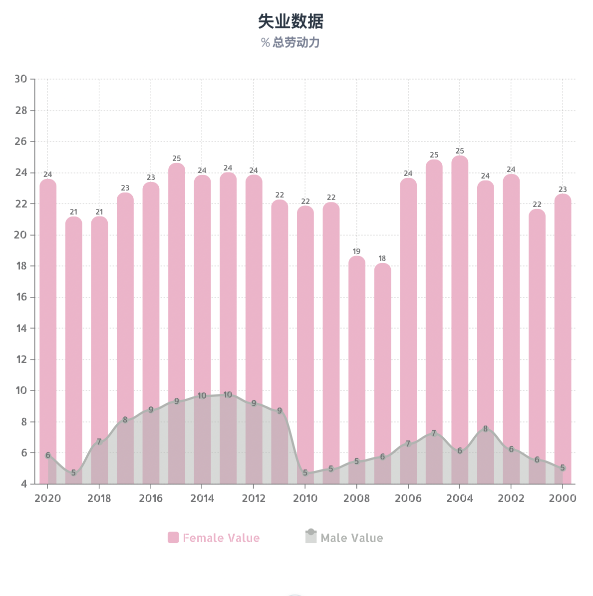

<html>
<head>
    
   
    
    
</head>

<body>
    

    <h1 style="font-style: italic;font-size: xx-large;font-weight: bold;font-family:'Lucida Sans', 'Lucida Sans Regular', 'Lucida Grande', 'Lucida Sans Unicode', Geneva, Verdana, sans-serif;">埃及近20年的社会发展 （2000-2020）</h1>

 

    
本文用数据分析埃及最近20年的社会发展变化。

    
首先是2000-2020年埃及人口

    
    
数据来源：世界银行
    

        
    
数据来源：世界银行

    

        
埃及女性平均寿命74岁，男性70岁。

        

           埃及43%的人口生活在城市，57%在农村。城市人口在20年间几乎没有变化。从一个侧面说明埃及新增人口主要在农村地区。

        
只有大概45%的人愿意在城区生活的，其他事选择在农村里生活。

    

    
    
数据来源：埃及中央公共动员和统计局
    

    

    

        根据上面的图，我们来分析一下埃及最受欢迎的行业根据2021年的统计数据，农业劳动力占总劳动力的19.2%。其次是贸易以及零售，占15%，排在第三的是建筑业，占13.8%，第四个是制造业，占12.6%。 第五是运输行业，占8.9%.

    
埃及的农业人口，主要集中在尼罗河两岸。由于尼罗河水灌溉，这一带农业发达。从地图上可以看到，埃及北部靠近尼罗河的地方，劳动力人数最密集。

    
接下来介绍埃及劳动力分布地图，我们能看到，接近首都的城市劳动力数量要高一点。

 
    
    
数据来源：埃及中央公共动员和统计局
    

        

    
如果拿埃及地图做简单的分析，我们能学到，在尼罗河的两岸这地方，农业最发达的。所以人口比较多的北方靠近尼罗河的一些城市劳动力人数最多。

        
 
        
    
数据来源：埃及中央公共动员和统计局
    

        

    

        埃及劳动力人口中，男女性别差别非常大。原因有很多:一是农村地区女性识字率较低，工作机会少；二是女性工资普遍低于男性；三是女性无法获得较好的社会保险。
    

    

    
    
数据来源：埃及中央公共动员和统计局
    
    

        

    
 女性就业数字远低于男性，同样，女性失业人数远高于男性。

    

    
    
数据来源：埃及中央公共动员和统计局
    

        
        

    
由于以上原因，在埃及选择从事自由职业的人中，女性比男性要多

    
20年的平均值是：女性为43.6%，男性为36.3%

    

    
    
数据来源：世界银行
        

         
 
 作者：安琳

             
 指导老师：白净教授

             
 南京大学｜新闻传播学院

    

